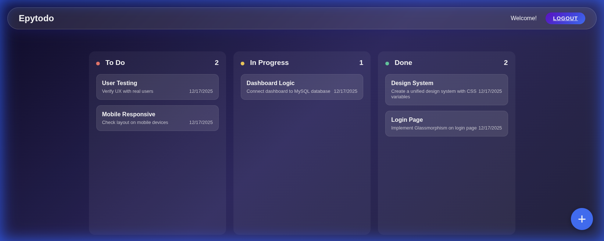

# SaaS-Ready-Premium-Task-Manager



Une application de gestion de tâches premium et moderne, conçue avec une esthétique **Glassmorphism** et une attention particulière portée à l'expérience utilisateur. Développé avec Node.js et Express, ce projet démontre une refonte complète de l'UI/UX d'une application web classique.

## 🌟 Fonctionnalités

-   **UI/UX Moderne** : Mode Sombre élégant avec des éléments en Glassmorphism.
-   **Animations Fluides** : Transitions douces et éléments interactifs.
-   **Tableau de Bord Kanban** : Visualisez les tâches dans les colonnes À faire, En cours et Terminé.
-   **Design Responsive** : Entièrement optimisé pour les ordinateurs et les mobiles.
-   **Authentification Sécurisée** : Système d'inscription et de connexion utilisateur.

## 🛠️ Stack Technique

-   **Frontend** : EJS (Templating), CSS3 (Variables, Flexbox, Grid), Vanilla JS.
-   **Backend** : Node.js, Express.js.
-   **Base de Données** : MySQL.
-   **Authentification** : JWT, Bcrypt.js.

## 🚀 Installation

1.  **Cloner le dépôt**
    ```bash
    git clone git@github.com:JosueNANTHAKUMAR/SaaS-Ready-Premium-Task-Manager.git
    cd epytodo/bonus
    ```

2.  **Installer les dépendances**
    ```bash
    npm install
    ```

3.  **Configurer la Base de Données**
    -   Importez `epytodo.sql` dans votre base de données MySQL.
    -   Créez un fichier `.env` dans le dossier `bonus` :
        ```env
        MYSQL_HOST=localhost
        MYSQL_USER=root
        MYSQL_ROOT_PASSWORD=votre_mot_de_passe
        MYSQL_DATABASE=epytodo
        PORT=3000
        ```

4.  **Lancer l'Application**
    ```bash
    npm start
    ```

5.  **Accéder à l'App**
    Ouvrez `http://localhost:3000` dans votre navigateur.

## 📸 Galerie

| Écran de Connexion | Écran d'Inscription | Tableau de Bord |
|:---:|:---:|:---:|
|  |  |  |

---

*Conçu & Développé par Josué - 2025*
